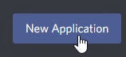
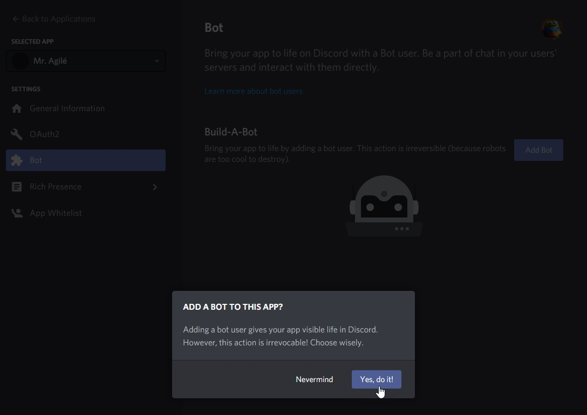
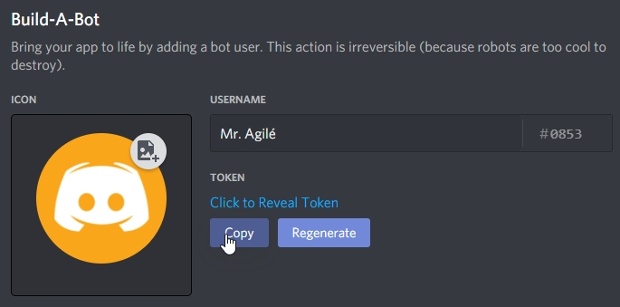
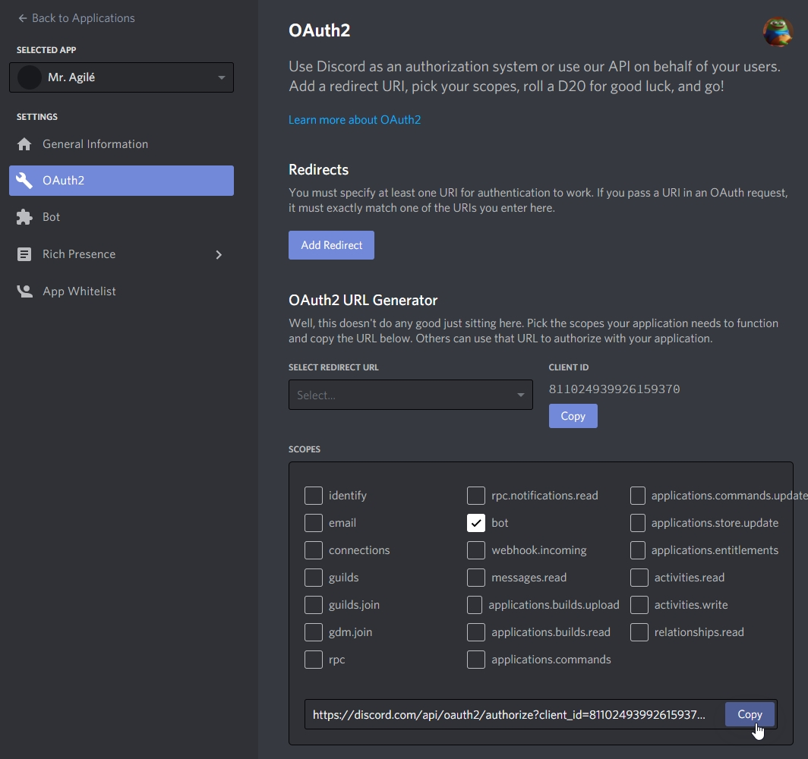
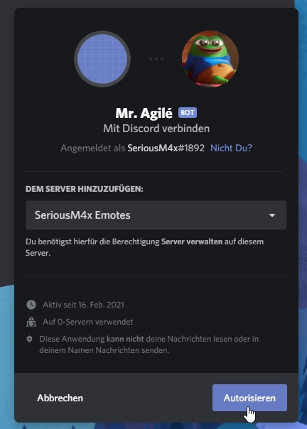
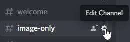
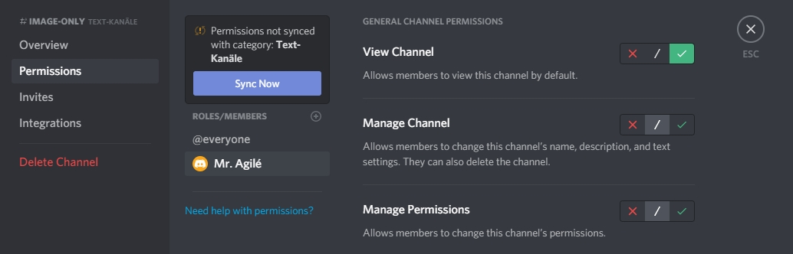
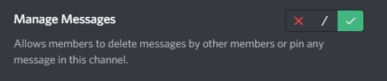

# Discord Image Only Bot

Only allow images or image links in a discord channel.

## Installation

1. Create a new discord application [here](https://discord.com/developers/applications).
   
2. Click "Bot" on the left and "Add Bot" and agree.
   
3. Copy the Token and paste it in the `docker-compose.yml`.
   
4. Click "OAuth2" on the left, under "scopes" tick the "bot" checkbox.
   
5. Copy the url, paste it into your browser and select a server.
   
   The bot is on your server now.
6. Edit the image only channel
   
   Go to "Permissions" and give the bot "View channel" at the very top, "Manage Messages" and save.
   
   
7. `docker-compose up -d`
